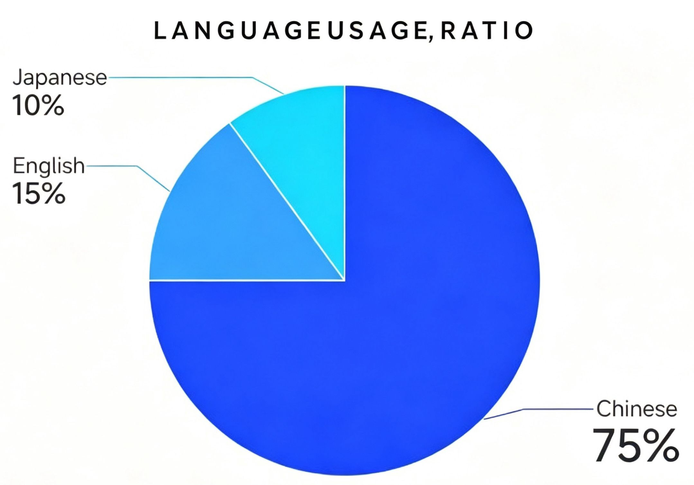
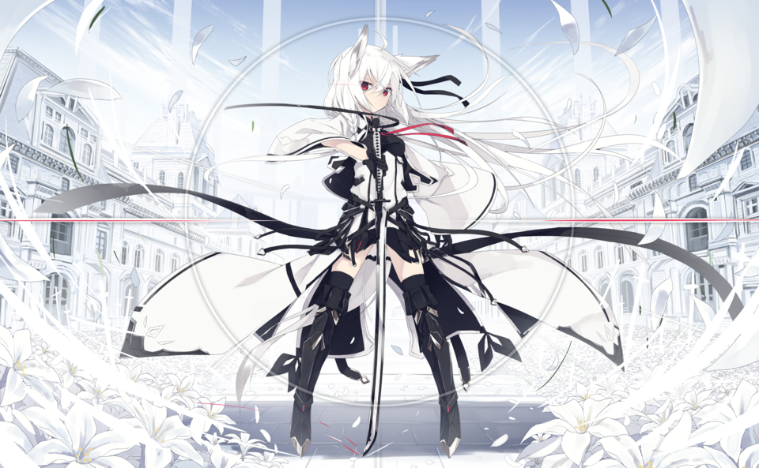

  

 

 
 
 

<h1>Hi there, I'm XiaoQi「小祁」^_^</h1>  
<h3>About Me</h3>

- Name: **XiaoQi「小祁」**.

- From: **A mysterious place in China♪───Ｏ（≧∇≦）Ｏ────♪**.

- Day job: **I write code occasionally and have a little experience with many different things (●°u°●) 」**.

- Currently: **I mainly use Python, and sometimes also look into other technologies ~miao~**.

- Also: Vice-President of [@linuxuigm](https://github.com/linuxuigm), **GNU/Linux** Enthusiast.

- Tech Stack:Python · PyCharm · VS Code · Git · txt · Vim · Markdown·and so on……

- About my socials: I'm not very good at bragging, but you're very welcome to chat with me Whether it's about technology or daily life, I'll reply seriously when I see.

 
 

 
 

<h1>Here is an interesting story about one of my friends.^_^</h1>  
  
<!-- BLOG_RSS_START -->
- 🦋 [***DawgCTF 2026 - I Hate Physics! - Cryptography Writeup***](https://blog.rei.my.id/posts/139/dawgctf-2026-i-hate-physics-cryptography-writeup/)
- 🦋 [***DawgCTF 2026 - Machine Learnding - Reverse Engineering Writeup***](https://blog.rei.my.id/posts/140/dawgctf-2026-machine-learnding-reverse-engineering-writeup/)
- 🦋 [***DawgCTF 2026 - Locksmith - OSINT Writeup***](https://blog.rei.my.id/posts/142/dawgctf-2026-locksmith-osint-writeup/)
- 🦋 [***DawgCTF 2026 - owo? - OSINT Writeup***](https://blog.rei.my.id/posts/143/dawgctf-2026-owo-osint-writeup/)
- 🦋 [***DawgCTF 2026 - Computer Repair III - OSINT Writeup***](https://blog.rei.my.id/posts/141/dawgctf-2026-computer-repair-iii-osint-writeup/)
- 🦋 [***DawgCTF 2026 - The Lookout's Legend - OSINT Writeup***](https://blog.rei.my.id/posts/144/dawgctf-2026-the-lookouts-legend-osint-writeup/)
- 🦋 [***DawgCTF 2026 - Plane Spotting Pt. 1 - OSINT Writeup***](https://blog.rei.my.id/posts/145/dawgctf-2026-plane-spotting-pt-1-osint-writeup/)
- 🦋 [***DawgCTF 2026 - Plane Spotting Pt. 3 - OSINT Writeup***](https://blog.rei.my.id/posts/146/dawgctf-2026-plane-spotting-pt-3-osint-writeup/)
- 🦋 [***TexSAW 2026 - You Snoze You Loze - OSINT Writeup***](https://blog.rei.my.id/posts/119/texsaw-2026-you-snoze-you-loze-osint-writeup/)
- 🦋 [***TexSAW 2026 - A Different Side Channel - Forensics Writeup***](https://blog.rei.my.id/posts/120/texsaw-2026-a-different-side-channel-forensics-writeup/)
<!-- BLOG_RSS_END -->

 
 
“People with evil intent can do evil things without lying. And not all liars are evil.” – Elaina&nbsp;&nbsp;&nbsp;&nbsp;&nbsp;&nbsp;&nbsp;&nbsp;&nbsp;&nbsp;&nbsp;&nbsp;&nbsp;&nbsp;&nbsp;&nbsp;&nbsp;&nbsp;&nbsp;&nbsp;&nbsp;&nbsp;&nbsp;&nbsp;&nbsp;&nbsp;&nbsp;&nbsp;&nbsp;&nbsp;&nbsp;&nbsp;&nbsp;&nbsp;&nbsp;&nbsp;&nbsp;&nbsp;&nbsp;&nbsp;&nbsp;&nbsp;&nbsp;&nbsp;&nbsp;&nbsp;&nbsp;&nbsp;&nbsp;&nbsp;&nbsp;&nbsp;&nbsp;&nbsp;&nbsp;&nbsp;&nbsp;contact : 401817506@qq.com
  

        

